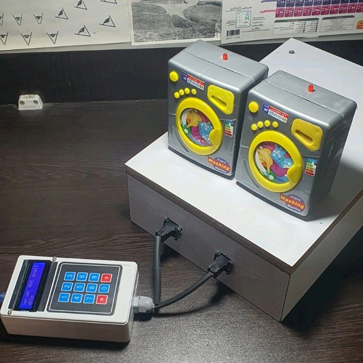
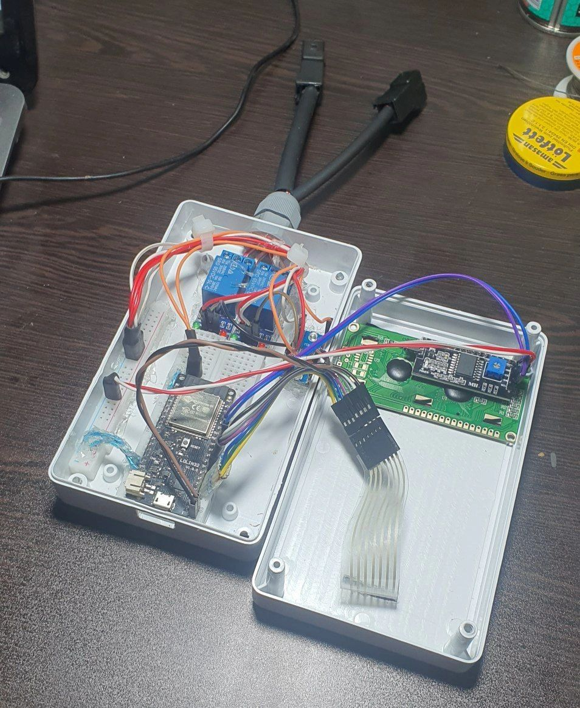
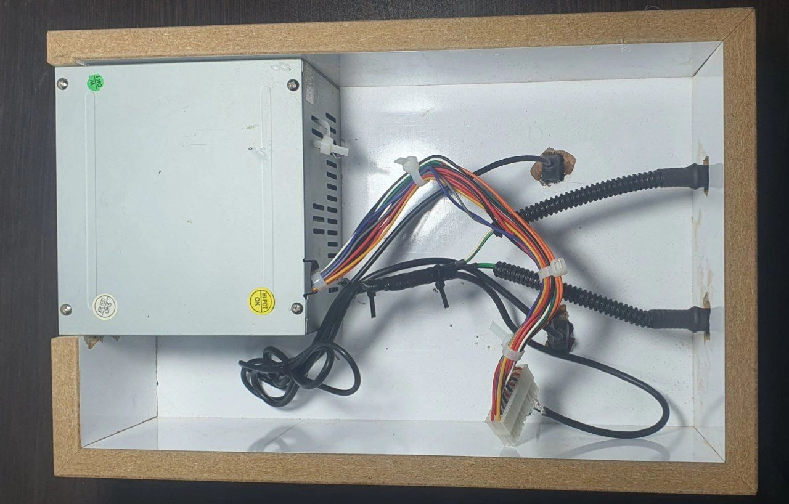
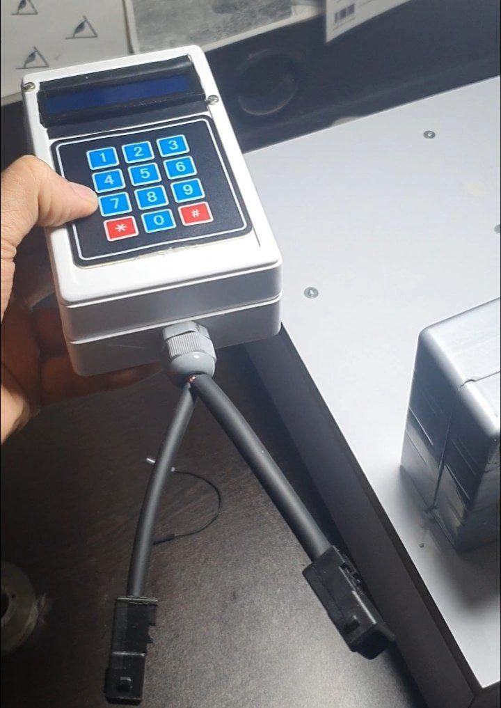
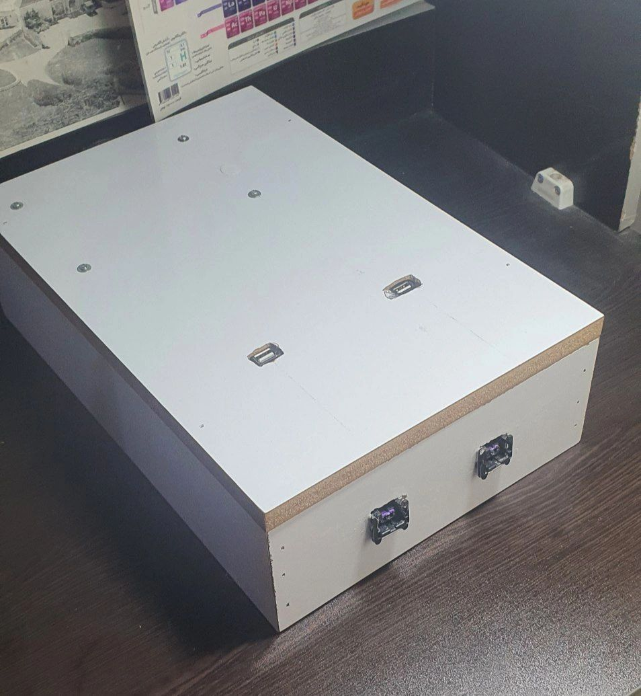

# LaundryMate: A Web-Based Washing Machine Reservation System

This project aims to create a web-based reservation system for managing washing machines in dormitories.


## Features

1. **Reservation System**:
   - Students can reserve a washing machine for a specific day and time.
   - Upon successful reservation, they receive a unique reservation code.

2. **Activation Mechanism**:
   - Students enter their reservation code at the laundry room.
   - The system activates the corresponding washing machine.

3. **Monitoring and Management**:
   - Keep track of machine availability and usage.
   - Send notifications to students before their reserved time slot.

## Installation
### Laravel Application

1. Clone this repository: https://github.com/6amir6hosein6/KNTU-Washing-Machine-Management.git

2. Set up the database (e.g., MySQL, PostgreSQL).

3. Install dependencies:

```
Composer Install
```
### Device Application
1. Connect the ESP32 to your computer using a USB cable.
2. Place the Python code inside the directory located in the `Device Code` folder.

## Screenshots






